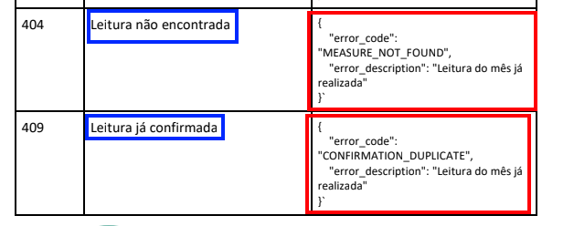

<h1 align="center">
    Water Gas Gemini API
</h1>

    

    A simple API built with NestJS that communicates with Google's LLM model <b><a href="https://deepmind.google/technologies/gemini/flash/">Gemini</a></b> to capture water and gas meter readings.
     
    <b>Versão em português deste README.md <a href="https://github.com/Arekushi/water-gas-gemini/blob/master/README.md">aqui</a></b>

## 📽️ About the Project
A technical test proposed by [Shopper.com][shopper], being one of the first stages to be carried out.
In this stage, the project must meet some specifications, and I did my best to fulfill them.

The project consists of a system that, given an image of a water or gas meter, performs a query to an LLM model with computer vision (in this case, Gemini) and stores this information in a database (relational or non-relational).

In this *README* document, I will detail some points that I found interesting to comment on, as well as, of course, documenting all the work I have done, thus serving as a repository for reference and personal portfolio.

## 🔨 Built with
- [Node v20.17.0][node]
- [Typescript v4.9.5][typescript]
- [NestJS v9.0.0][nestjs]
- [Prisma v5.19.0][prisma]

## 🤔 Why NestJS?
With so many frameworks on the market, why choose NestJS? Instead of [Express][express]? [Fastify][fastify]? [AdonisJS][adonisjs]? There are **MANY** frameworks out there, and they are constantly being updated. It is true that Node.js is not always the go-to choice when some developers need to create an API system in a market with [Spring][spring] and [.NET][dotnet], so choosing NestJS is quite curious.

Since the test required it to be done in **Node.js** and using **Typescript**, I opted for the framework where I feel most free to create code, which is NestJS. The flexibility that NestJS provides is a very positive point, its modular architecture allows the project to be `organized` and `scalable`. This is something I tried to rely on, even in a small project; it is always necessary to try to apply the best practices and keep the code as clean as possible, as this is part of evolving.
The resources found in NestJS are vast...
> Do you want to do something specific? Probably in NestJS, you just need to create a *pipe*, *filter*, or *interceptor* to do it easily and cleanly.

NestJS uses Express under the hood by default, but creating an Express project and making it robust is difficult; it's easier to create a NestJS project that is already robust and just add what you want or don't want to the project, such as documentation with [Swagger][swagger], for example.

I already have experience with NestJS, having done some projects in college, and its structure is quite similar to [Angular][angular], which I also appreciate and have more mastery of.

## 💎 Why Prisma?
Prisma has been one of my favorite Object-Relational Mapping (ORM) tools lately. It is **easy** and **practical** to use, and it's everything a programmer needs.

Since the database to be used was not specified, the possibilities are endless, as long as the data is saved somewhere (right?). Normally, I remember two other popular ORMs: [Mongoose][mongoose] (for [MongoDB][mongodb]) and [TypeORM][typeorm] (which covers several relational databases, including MongoDB). But when thinking about productivity, I can't think of another ORM outside of Prisma.

## 🗃️ Schema

    

This is the database schema developed, with only 3 entities: `customer`, `measure`, and `measure_type`.

Since an ER (entity-relationship) diagram was not provided, I created one that made sense and met the requirements.

It is worth noting that `measure_type` didn't really need to exist, as it only involves two possible values, but as I always try to preserve normal forms, I decided to keep it this way.

## 💻 Development

### 📍 Endpoints
In the endpoints, I removed the global prefix and the controllers' prefix.

I did this because it wasn't made clear in the document whether prefixes could be used or not in the endpoints. Since the tests will be automated by scripts, this could be a problem, so I left all the endpoints of interest at the root.

Below is my structure **with** prefixes:

* `/measure` - MeasureController
    * `/upload`
    * `/confirm`
* `/customer` - CustomerController
    * `/{customerId}/list`

### ✅ Unit Tests
This isn't something I do very often, and I admit that it is even a little difficult to think of logic to create tests that make sense. I didn't create the best tests, I recognize that; there's still room for improvement, but anyway, it was an additional learning experience and practice in creating unit tests.

### 🌓 Aspect-Oriented Programming
A not-so-popular programming paradigm, but one that I appreciate is **Aspect-Oriented Programming**. It is interesting because of the possibility of modularization and code reuse.

In this project, I created some aspects, and most of them just performed validation before or after a method, and if something went wrong, an error was thrown. This could be done within the method itself, without the aid of an **aspect**, but thinking about development, I see it as beneficial to separate business logic from certain actions that in a way "pollute" the code. The goal is always to achieve a high level of code maintainability, and with aspect-oriented programming, this can be facilitated.

I forked a Node.js Aspect-Oriented Programming library some time ago; the original developer no longer provides much support, so I created improvements and new features. The library is [ts-aspect][tsaspect].

### 🐋 Docker and Containers
Docker may seem like a seven-headed beast, but it’s not exactly like that; it’s a very robust tool that makes work easier, makes the project scalable, portable, and finally, deployable.

My implementation currently has only two services, which are the API and the database, but if you want to add the front end, for example, it is just another image to be built into the container that is this project.

The Dockerfile is quite simple; the only thing I had to pay attention to was Prisma, as it is necessary to run a migrate command for the database to be created. I admit I had some difficulty when building the Docker image with Prisma. In fact, I've always had difficulties, so this project was another opportunity to try to understand better how it works and how to work with it together with Docker.

### ❌ Validations and Exception Handler
As requested, I paid attention to the expected output at each endpoint and the responses given in each context.

NestJS helped a lot with this, after all, it has tools that facilitate the entire process, such as creating `filters` to catch certain errors and return them in another way. I used an `interceptor` to convert *snake_case* to *camelCase*, as in the PDF document examples, they were in *snake_case*, but code in JS/TS is usually in *camelCase*. I used `class-validator` to validate the request body, whether it was in accordance or not, and if not, an exception would be thrown.

There are some things to comment on; I get a little suspicious when I find clear mistakes in exercises, as they might be traps... Whether they are or not, I think it’s worth mentioning.

    

The message in the `error_description` attribute in the JSON `response` body does not match the description and is also a duplicate of another error message. In any case, I followed the error messages exactly as instructed.

### 🤖 Gemini API
The issue with the Gemini API was simple, thanks to the library provided by Google itself: [generative-ai][genai].

It made the whole process easier; the only difficulty was understanding more or less what it did and how to apply it to the project in a structured and clean way. Therefore, I created a Gemini module where I have a `service` that only has one method: sending the image along with a prompt.

### 🐘 SQLite and Postgres
Initially, I created the project using [SQLite][sqlite] and kept it that way until I got to the part of using `docker-compose`, where I could create an exclusive service for [PostgreSQL][postgres], which is much more robust than a SQLite application.

## 👍 Acknowledgments
Here is a [link][acknowledgments] to a Notion page where the materials that supported me in the development of this application are listed. 😉

## 👨‍💻 Contributors
| [
 Alexandre Ferreira de Lima alexandre.ferreira1445@gmail.com
][arekushi] 
💻
 |
| :---: |

<!-- [Build With] -->
[nestjs]: https://nestjs.com/
[prisma]: https://www.prisma.io/
[node]: https://nodejs.org/dist/latest-v20.x/docs/api/
[typescript]: https://www.typescriptlang.org/

<!-- [Some links] -->
[shopper]: https://shopper.gupy.io/
[express]: https://expressjs.com/
[fastify]: https://fastify.dev/
[adonisjs]: https://adonisjs.com/
[angular]: https://angular.dev/
[mongoose]: https://mongoosejs.com/docs/
[typeorm]: https://typeorm.io/
[spring]: https://spring.io/
[dotnet]: https://dotnet.microsoft.com/
[genai]: https://www.npmjs.com/package/@google/generative-ai
[tsaspect]: https://github.com/Arekushi/ts-aspect
[swagger]: https://swagger.io/
[mongodb]: https://www.mongodb.com/
[sqlite]: https://www.sqlite.org/
[postgres]: https://www.postgresql.org/

[acknowledgments]: https://arekushi.notion.site/Reconhecimentos-da634c7722c04f7eabda78053f11518f?pvs=4

<!-- [Constributors] -->
[arekushi]: https://github.com/Arekushi
