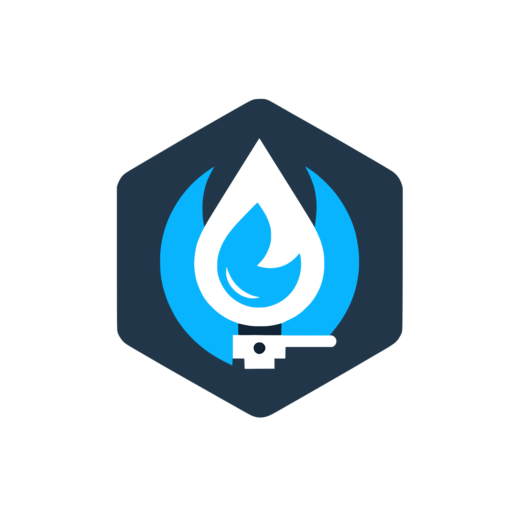
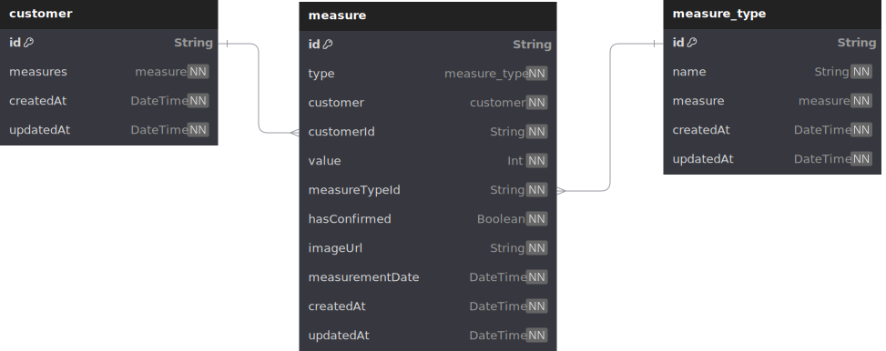
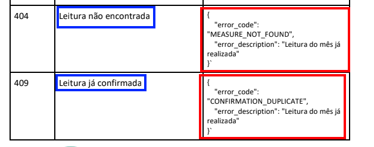

<h1 align="center">
    Water Gas Gemini API
</h1>

    

    API simples em NestJS que estabelece uma comunicação com o modelo de LLM <b><a href="https://deepmind.google/technologies/gemini/flash/">Gemini</a></b> da Google para capturar o valor de medidores de água e gás.
     
    <b>English version of this README.md <a href="https://github.com/Arekushi/water-gas-gemini/blob/master/README.en.md">here</a></b>

## 📽️ Sobre o Projeto
Teste técnico proposto pela [Shopper.com][shopper], sendo uma das primeiras etapas a serem realizadas.
Nessa etapa é necessário que o projeto atenda algumas específicações, e que dei o meu melhor para atendê-las.

O projeto consiste em um sistema que dado uma imagem de um hidrômetro ou medidor de gás, seja realizado uma consulta em um modelo de LLM com visão computacional (nesse caso, o Gemini), e guarde essa informação em um banco de dados (relacional ou não relacional).

Nesse documento de *README*, irei detalhar alguns pontos que achei interessante comentar, além de claro, deixar documentado todo meu trabalho realizado, assim, servindo como repositório para consulta e portifólio pessoal.

## 🔨 Construído com
- [Node v20.17.0][node]
- [Typescript v4.9.5][typescript]
- [NestJS v9.0.0][nestjs]
- [Prisma v5.19.0][prisma]

## 🤔 Por que NestJS?
De tantos frameworks no mercado, por que escolher o NestJS? Ao invés de um [Express][express]? [Fastify][fastify]? [AdonisJS][adonisjs]? Enfim, existem **MUITOS** frameworks por ai, e constantemente sendo atualizados. É certo que o Node.JS nem sempre é a escolha que normalmente alguns programadores escolhem na hora de montar um sistema de API, em um mercado com [Spring][spring] e [.NET][dotnet], realmente escolher o NestJS é curioso.

Como o teste necessitava de ser em **Node.JS** e usando **Typescript**, optei pelo *framework* que sinto maior liberdade na criação de códigos, que é o NestJS. A flexibilidade que o NestJS te proporciona é um ponto muito positivo, sua arquitetura modular permute que o projeto seja `organizado` e `escalável`. Nisso foi algo que tentei me apoiar, mesmo que em um projeto pequeno, é preciso tentar sempre aplicar as melhores técnicas e manter o código o mais limpo possível, isso é evolução.
Os recursos encontrados no NestJS são muito vastos...
> Deseja fazer tal coisa específica? Provavelmente no NestJS é só criar um *pipe*, *filter* ou *interceptor* que tu vai conseguir de maneira fácil e limpa

NestJS usa o Express por de baixo dos panos por padrão, mas criar um projeto Express e torná-lo robusto é difícil, é mais simples criar um projeto NestJS que já é robusto, e só ir adicionando o que deseja ou não ao projeto, como a documentação do [Swagger][swagger], por exemplo.

Já tenho experiência com o NestJS, fiz alguns projetos na faculdade, além da sua estrutura ser bastante parecida com o [Angular][angular], que também tenho bastante apreço de maior domínio.

## 💎 Por que Prisma?
Prisma tem sido um dos meus *Object-Relational Mapping* (ORM) favoritos dos últimos tempos, ele é **fácil** e **prático** de ser usado, e é tudo que um programador precisa.

Como não foi específicado o banco de dados a ser utilizado, as possibilidade são infinitas, contanto que os dados sejam salvos em algum lugar (não é?). De cabeça, lembro de outros dois ORMs populares, que é o [Mongoose][mongoose] (para [MongoDB][mongodb]) e [TypeORM][typeorm] (que cobre vários SGBDs relacionais, inclusive o MongoDB também). Mas pensando em produtividade, não consigo pensar em outro ORM fora o Prisma.

## 🗃️ Schema

    

Esse é o esquema do banco de dados desenvolvido, somente com 3 entidades: `customer`, `measure` e `measure_type`.

Como não foi fornecido um diagrama ER (entidade-relacionamento), criei um que fizesse sentido e atendesse os requisitos.

Vale citar que, `measure_type` realmente não precisava existir, já que só se trava de dois valores possíveis, mas como tento sempre presevar as formas normais, decidi manter dessa forma.

## 💻 Desenvolvimento

### 📍 Endpoints
Nos endpoints, removi o prefixo global e prefixo das controllers.

Fiz isso pois no documento, como não é deixado claro, não é possível saber com exatidão se poderia ter prefixos ou não nos endpoints. Como os testes serão automatizados por scripts, isso poderia ser um problema, dessa forma, deixei todos os endpoints de interesse na raíz.

Deixarei abaixo minha estrutura **com** prefixos:

* `/measure` - MeasureController
    * `/upload`
    * `/confirm`
* `/customer` - CustomerController
    * `/{customerId}/list`

### ✅ Testes Unitários
Isso não é algo que faço com tanta frequência, e confesso que é até um pouco difícil de pensar em lógica para criar testes que façam sentido. Não fiz os melhores testes, isso eu reconheço, ainda dá pra melhorar bastante, de todo modo, foi um aprendizado e prática adicional na criação de testes unitários.

### 🌓 Orientação a Aspecto
Um paradigma de programação não tão popular, mas que tenho um certo apreço é a **Orientação a Aspecto**. Ela é interessante pela possibilidade de modularização e reutilização de código.

Nesse projeto, fiz alguns aspectos, e a maioria só realizava uma validação antes ou depois de um método, e caso desse tudo errado, estourava um erro. O que pode ser feito dentro do próprio método, sem o auxílio de um **aspecto**, porém, pensando em desenvolvimento, vejo como algo benéfico, separar a regra de negócio de determinadas ações que de certa forma "poluem" o código. O objetivo sempre é atingir um nível alto de manutenção de código, e com orientação a aspectos isso pode ser facilitado.

Eu fiz um fork tempos atrás de uma lib de Orientação a Aspecto em Node.JS, o desenvolvedor original não dá mais tanto suporte, então criei melhorias e novas features, a biblioteca é [ts-aspect][tsaspect].

### 🐋 Docker e containers
Docker parece um bicho de 7 cabeças, mas não é exatamente assim, ele é uma ferramente bem robusca e que proporciona maior facilidade na hora de trabalhar, tornar o projeto escalável, portabilizar ele, por fim, implantar.

Minha implementação atualmente tem somente dois serviços, sendo eles, a API e o banco de dados, mas se for adicionar o *front-end*, por exemplo, é mais uma imagem *'buildada'* para dentro do conteiner que é esse projeto.

Dockerfile tá sem simple mesmo, única coisa que tive que me atentar era com o Prisma, pois é necessário dar um migrate para que o banco seja criado. É certo que tive um pouco de dificuldade na hora de montar a imagem Docker com o Prisma, na realidade, sempre tive dificuldades, então esse projeto foi mais uma oportunidade de tentar entender melhor como ele funciona e como trabalhar com ele junto com o Docker.

### ❌ Validações e Exception Handler
Como solicitado, permaneci atento a saída esperada em cada endpoint, e em cada resposta dado algum contexto.

Nisso o NestJS ajudou bastante, afinal, ele tem ferramentas que facilitam todo esse processo, como criar `filters` para capturar determinados erros e retornar de uma outra forma. Usei um `interceptor` para converter *snake_case* para *camelCase*, pois nos exemplos do documento PDF estavam em *snake_case*, mas código em JS/TS normalmente é em *camelCase*. O `class-validator` para validar o body das requests, se está de acordo ou não, e se não, estourar uma excessão.

Há coisas a se comentar, fico com um pé atrás quando encontro erros claros em exercícios, pois, podem ser pegadinhas... sendo ou não, acho bom comentar.

    

A mensagem do atributo `error_description` no corpo do JSON de `response` não condiz com a descrição, além de ser uma mensagem duplicada de um outro erro. De qualquer forma, segui à risca as mensagens de erro.

### 🤖 API do Gemini
A questão da API do Gemini foi simples, graças a biblioteca disponibilizada pela própria Google: [generative-ai][genai].

Ela facilitou todo o processo, a unica dificuldade foi em entender mais ou menos o que ela fazia e como aplicar isso no projeto de forma estruturada e limpa. Dessa forma, criei um módulo só do Gemini, onde tenho um `service` que possui apenas um método, o de realizar o envio da imagem junto com um prompt.

### 🐘 SQLite e Postgres
Inicialmente criei o projeto usando [SQLite][sqlite], e mantive assim até chegar na parte de usar `docker-compose`, onde posso criar um serviço exclusivo para o [PostgreSQL][postgres], que é bem mais robusto que uma aplicação SQLite.

## 👍 Reconhecimentos
Aqui está um [link][acknowledgments] de uma página no Notion onde estão materiais que me apoiaram no desenvolvimento dessa aplicação. 😉

## 👨‍💻 Contribuidores
| [
 Alexandre Ferreira de Lima alexandre.ferreira1445@gmail.com
][arekushi] 
💻
 |
| :---: |

<!-- [Build With] -->
[nestjs]: https://nestjs.com/
[prisma]: https://www.prisma.io/
[node]: https://nodejs.org/dist/latest-v20.x/docs/api/
[typescript]: https://www.typescriptlang.org/

<!-- [Some links] -->
[shopper]: https://shopper.gupy.io/
[express]: https://expressjs.com/
[fastify]: https://fastify.dev/
[adonisjs]: https://adonisjs.com/
[angular]: https://angular.dev/
[mongoose]: https://mongoosejs.com/docs/
[typeorm]: https://typeorm.io/
[spring]: https://spring.io/
[dotnet]: https://dotnet.microsoft.com/
[genai]: https://www.npmjs.com/package/@google/generative-ai
[tsaspect]: https://github.com/Arekushi/ts-aspect
[swagger]: https://swagger.io/
[mongodb]: https://www.mongodb.com/
[sqlite]: https://www.sqlite.org/
[postgres]: https://www.postgresql.org/

[acknowledgments]: https://arekushi.notion.site/Reconhecimentos-da634c7722c04f7eabda78053f11518f?pvs=4

<!-- [Constributors] -->
[arekushi]: https://github.com/Arekushi
